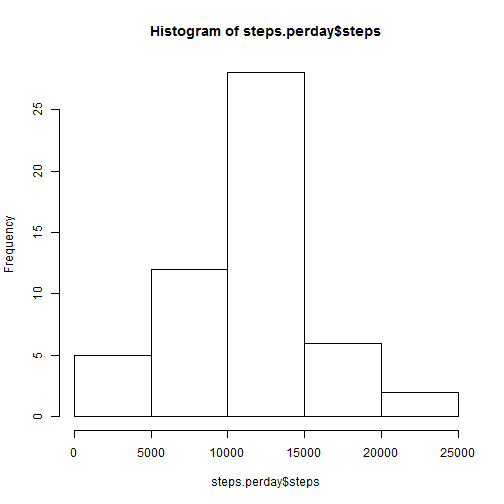
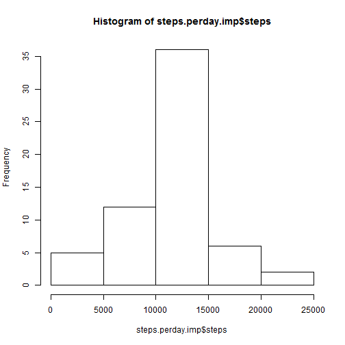
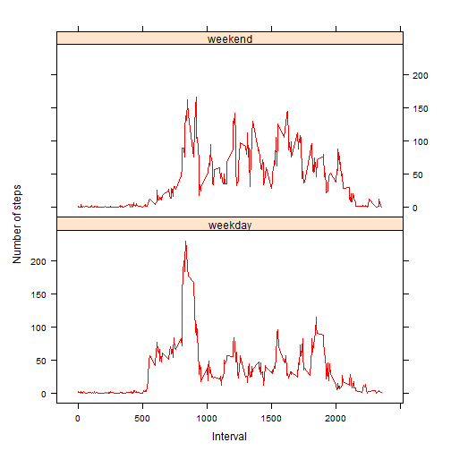

PA-1
========================================================
 ------------------------------------------------------------------------
**Course :**Reproducible Research.

**Dataset :**Activity monitoring data.

**Description :**This assignment makes use of data from a personal activity              monitoring device. This device collects data at 5 minute intervals through out the day. The data consists of two months of data from an anonymous individual collected during the months of October and November, 2012 and include the number of steps taken in 5 minute intervals each day.

**Objective :**You will need to write a report that answers the questions detailed below. Ultimately, you will need to complete the entire assignment in a single R markdown document that can be processed by knitr and be transformed into an HTML file.

**Instructions :**Throughout your report make sure you always include the code that you used to generate the output you present. When writing code chunks in the R markdown document, always use echo = TRUE so that someone else will be able to read the code.

This assignment will be evaluated via peer assessment so it is essential that your peer evaluators be able to review the code for your analysis.
For the plotting aspects of this assignment, feel free to use any plotting system in R (i.e., base, lattice, ggplot2).

Fork/clone the GitHub repository created for this assignment. You will submit this assignment by pushing your completed files into your forked repository on GitHub. 

The assignment submission will consist of the URL to your GitHub repository and the SHA-1 commit ID for your repository state.

**Data Url :** https://d396qusza40orc.cloudfront.net/repdata%2Fdata%2Factivity.zip
 ------------------------------------------------------------------------

**Variables:**

The variables included in this dataset are:

**steps :** Number of steps taking in a 5-minute interval (missing values are coded as NA)

**date :** The date on which the measurement was taken in YYYY-MM-DD format

**interval :** Identifier for the 5-minute interval in which measurement was taken
 ------------------------------------------------------------------------


```r
# House Keeping -----------------------------------------------------------
rm(list = ls())
gc()
```

```
##          used (Mb) gc trigger (Mb) max used (Mb)
## Ncells 242171 13.0     407500 21.8   350000 18.7
## Vcells 450218  3.5     905753  7.0   859051  6.6
```

```r
my.path <- "C:/Users/Diego/Documents/GitHub/Reproducible Research/RepData_PeerAssessment1"
setwd(my.path)
rm(my.path)
```


```r
# Download and Extract the File -------------------------------------------
# NOTE: The GitHub repository also contains the dataset for the assignment
# so you do not have to download the data separately.

# Please uncomment this line if you don't have the zipped file.

# fileZip <- './activity.zip';

# unzip(fileZip);

# rm(fileZip);
```


```r
# Check which files/folders were extracted --------------------------------
dir()
```

```
## [1] "activity.csv"      "activity.zip"      "doc"              
## [4] "figure"            "instructions_fig"  "PA1_template.html"
## [7] "PA1_template.md"   "PA1_template.Rmd"  "README.md"
```


```r
# Add a pointer to the working file ---------------------------------------
my.file <- "./activity.csv"
```

**Loading and preprocessing the data**

Show any code that is needed to:
  1. Load the data (i.e. read.csv())
  2. Process/transform the data (if necessary) into a format suitable for your analysis.

```r
# Explore the file --------------------------------------------------------
con <- file(my.file, "r")
first.lines <- readLines(con, n = 10)
close(con)
first.lines
```

```
##  [1] "\"steps\",\"date\",\"interval\"" "NA,\"2012-10-01\",0"            
##  [3] "NA,\"2012-10-01\",5"             "NA,\"2012-10-01\",10"           
##  [5] "NA,\"2012-10-01\",15"            "NA,\"2012-10-01\",20"           
##  [7] "NA,\"2012-10-01\",25"            "NA,\"2012-10-01\",30"           
##  [9] "NA,\"2012-10-01\",35"            "NA,\"2012-10-01\",40"
```


```r
# House keeping -----------------------------------------------------------
rm(list = c("con", "first.lines"))
```

 ------------------------------------------------------------------------
This file seems to be a well structured .csv file. Don't get confused by
the added backslash in front of each quotation mark: they are just escape
characters. So let's read the csv file with the read.csv function:
 ------------------------------------------------------------------------

```r
# Test read.csv -----------------------------------------------------------
activity <- read.csv(my.file)
```


```r
# House keeping -----------------------------------------------------------
rm(my.file)
```


```r
# Explore the activity data frame -----------------------------------------
head(activity)
```

```
##   steps       date interval
## 1    NA 2012-10-01        0
## 2    NA 2012-10-01        5
## 3    NA 2012-10-01       10
## 4    NA 2012-10-01       15
## 5    NA 2012-10-01       20
## 6    NA 2012-10-01       25
```

```r
summary(activity)
```

```
##      steps               date          interval   
##  Min.   :  0.0   2012-10-01:  288   Min.   :   0  
##  1st Qu.:  0.0   2012-10-02:  288   1st Qu.: 589  
##  Median :  0.0   2012-10-03:  288   Median :1178  
##  Mean   : 37.4   2012-10-04:  288   Mean   :1178  
##  3rd Qu.: 12.0   2012-10-05:  288   3rd Qu.:1766  
##  Max.   :806.0   2012-10-06:  288   Max.   :2355  
##  NA's   :2304    (Other)   :15840
```


```r
# Check count of unique values --------------------------------------------
setNames(c(length(unique(activity$steps)), length(unique(activity$date)), length(unique(activity$interval))), 
    c("steps", "date", "interval"))
```

```
##    steps     date interval 
##      618       61      288
```


```r
# Check if all dates are from October -------------------------------------
identical(dim(activity)[1], length(grep("2012-10-[0-3][0-9]", activity$date)))
```

```
## [1] FALSE
```


```r
# Check if all dates are from 2012 ----------------------------------------
identical(dim(activity)[1], length(grep("2012-[0-1][0-9]-[0-3][0-9]", activity$date)))
```

```
## [1] TRUE
```


```r
# Check activity data types -----------------------------------------------
sapply(activity, class)
```

```
##     steps      date  interval 
## "integer"  "factor" "integer"
```

 ------------------------------------------------------------------------
As we can observe these data need to be cleaned.

The **"steps"** field should be numeric as it is. But is has several NA's, 
is not normally distributed being severely skewed to the right, and has
important outliers.

The **"date"** field while seems to have a well formatted date, is not in the 
correct data type; it's a factor and needs to be date.

Therefore, the first step for cleaning this data set is to transform the
activity data types to the correct ones.
 ------------------------------------------------------------------------

```r
# Transform data types ----------------------------------------------------
activity$date <- as.Date(as.character(activity$date), "%Y-%m-%d")
```


```r
# Check transformations were correct --------------------------------------
sapply(activity, class)
```

```
##     steps      date  interval 
## "integer"    "Date" "integer"
```

 ------------------------------------------------------------------------
What is mean total number of steps taken per day?
For this part of the assignment, you can ignore the missing values in the 
dataset.
 ------------------------------------------------------------------------

```r
# Create a data frame for storing the mean and the median -----------------
mean.median <- data.frame(na.values = character(2), mean.value = numeric(2), 
    median.value = numeric(2), stringsAsFactors = FALSE)
```


```r
# Calculate the sum of steps per day --------------------------------------
steps.perday <- aggregate(formula = steps ~ date, data = activity, FUN = sum, 
    na.rm = F)
```


```r
# Make a histogram of the total number of steps taken each day ------------
hist(steps.perday$steps)
```

 


```r
# Calculate and report the mean total number of steps taken per day -------
mean.median[1, 1] <- as.character("missing")
mean.median[1, 2] <- mean(steps.perday$steps)
mean.median[1, 2]
```

```
## [1] 10766
```


```r
# Calculate and report the median total number of steps taken per --------
mean.median[1, 3] <- median(steps.perday$steps)
mean.median[1, 3]
```

```
## [1] 10765
```

 ------------------------------------------------------------------------
What is the average daily activity pattern?
Make a time series plot (i.e. type = "l") 
(x-axis) = 5-minute interval 
(y-axis) = average number of steps taken, averaged across all days 
 ------------------------------------------------------------------------

```r
# Calculate the average of steps per interval in the dataset --------------
steps.perinterval <- aggregate(formula = steps ~ interval, data = activity, 
    FUN = mean, na.rm = T)
```


```r
# Plot the steps per interval ---------------------------------------------
plot(steps.perinterval, type = "l")
```

 

 ------------------------------------------------------------------------
Which 5-minute interval, on average across all the days in the dataset, 
contains the maximum number of steps?
 ------------------------------------------------------------------------

```r
# Max average steps per interval ------------------------------------------
steps.perinterval[which.max(steps.perinterval$steps), ]$interval
```

```
## [1] 835
```

 ------------------------------------------------------------------------
**Imputing missing values:**

Note that there are a number of days/intervals where there are missing 
values (coded as NA). 
The presence of missing days may introduce bias into some calculations or 
summaries of the data.

Calculate and report the total number of missing values in the dataset 
(i.e. the total number of rows with NAs). 
 ------------------------------------------------------------------------

```r
# Calculate the number of rows with NA's ----------------------------------
dim(activity[!complete.cases(activity), ])[1]
```

```
## [1] 2304
```


```r
# Let's double check NA's per field ---------------------------------------
setNames(c(length(which(is.na(activity$steps))), length(which(is.na(activity$date))), 
    length(which(is.na(activity$interval)))), c("steps", "date", "interval"))
```

```
##    steps     date interval 
##     2304        0        0
```

 ------------------------------------------------------------------------
**Strategy for imputation:**

Devise a strategy for filling in all of the missing values in the dataset.# 
The strategy does not need to be sophisticated. 
For example, you could use the mean/median for that day, or the mean for 
that 5-minute interval, etc.
 ------------------------------------------------------------------------
 ------------------------------------------------------------------------
**Answer**

Since we already have the mean per interval calculated, I'm going to use
that for imputation purposes.
 ------------------------------------------------------------------------
 ------------------------------------------------------------------------

**Imputation:**

Create a new dataset that is equal to the original dataset but with the 
missing data filled in.
 ------------------------------------------------------------------------ 

```r
# Create a copy of the activity data frame --------------------------------
activity.imp <- activity
# ------------------------------------------------------------------------
```


```r
# Impute steps NA's -------------------------------------------------------
activity.imp$steps <- ifelse(is.na(activity.imp$steps), round(replace(activity.imp$steps, 
    which(steps.perinterval[, 1] == activity.imp$interval), steps.perinterval$steps), 
    digits = 0), activity.imp$steps)
```

 ------------------------------------------------------------------------
Make a histogram of the total number of steps taken each day and 
Calculate and report the mean and median total number of steps taken per 
day. 
 ------------------------------------------------------------------------

```r
# Calculate the sum of steps per day --------------------------------------
steps.perday.imp <- aggregate(formula = steps ~ date, data = activity.imp, FUN = sum, 
    na.rm = F)
```


```r
# Make a histogram of the total number of steps taken each day ------------
hist(steps.perday.imp$steps)
```

 


```r
# Calculate and report the mean total number of steps taken per day -------
mean.median[2, 1] <- as.character("imputed")
mean.median[2, 2] <- mean(steps.perday.imp$steps)
mean.median[2, 2]
```

```
## [1] 10766
```


```r
# Calculate and report the median total number of steps taken per --------
mean.median[2, 3] <- median(steps.perday.imp$steps)
mean.median[2, 3]
```

```
## [1] 10762
```


```r
# Raw vs Imputed ----------------------------------------------------------

mean.median
```

```
##   na.values mean.value median.value
## 1   missing      10766        10765
## 2   imputed      10766        10762
```

 ------------------------------------------------------------------------
Do these values differ from the estimates from the first part of the 
assignment? 
 ------------------------------------------------------------------------
**Answer**

Yes.
 ------------------------------------------------------------------------
**Imputation impact**

What is the impact of imputing missing data on the estimates of the total 
daily number of steps?
 ------------------------------------------------------------------------
**Answer** 
 The mean and the median remain almost equal, but the histogram looks more
 smooth, and the quantiles have changed.
 ------------------------------------------------------------------------ 
 ------------------------------------------------------------------------

Are there differences in activity patterns between weekdays and weekends?
For this part the weekdays() function may be of some help here. 

Use the dataset with the filled-in missing values for this part.

Create a new factor variable in the dataset with two levels - "weekday" 
and "weekend" indicating whether a given date is a weekday or weekend day. 

```r
# Create the factor variable ----------------------------------------------
activity.imp["weekdays"] <- as.factor(ifelse(weekdays(activity.imp$date) %in% 
    c("Saturday", "Sunday"), "weekend", "weekday"))
```

 ------------------------------------------------------------------------
Make a panel plot containing a time series plot (i.e. type = "l") of the 
5-minute interval (x-axis) and the average number of steps taken, averaged 
across all weekday days or weekend days (y-axis). 

```r
steps.perinterval.wkd <- aggregate(formula = steps ~ interval + weekdays, data = activity.imp, 
    FUN = mean)
```


```r
library(lattice)
xyplot(steps ~ interval | weekdays, data = steps.perinterval.wkd, cex = 2, type = "l", 
    col = rainbow(2), xlab = "Interval", ylab = "Number of steps", aspect = 1/2)
```

 

